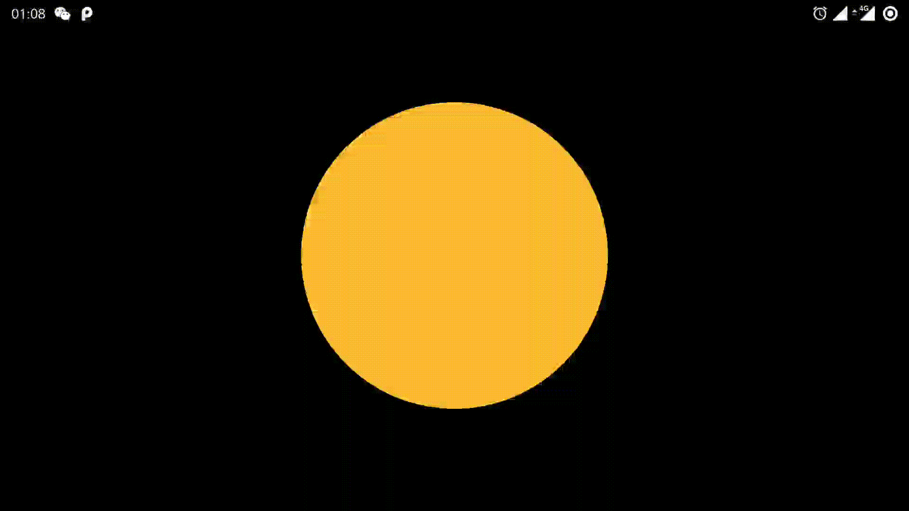
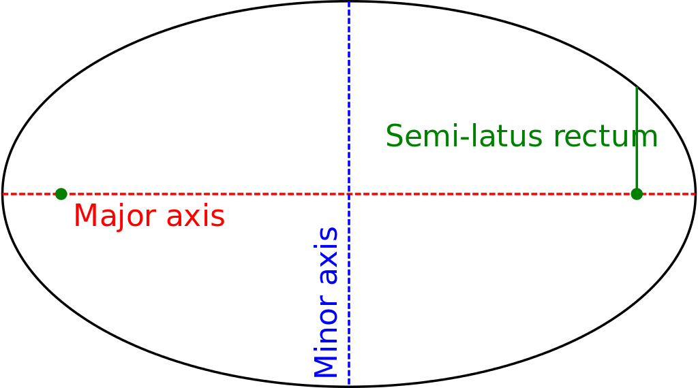
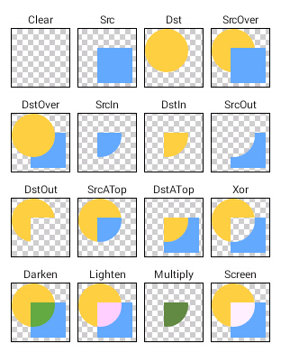

来了~ 蹭中秋热度赖了 ~

项目地址：[LunarPhase](https://github.com/bqbs/lunarphase) << 点击前往同性交友网站

### LunarPhase
AKA 月相。什么是月相？[维基百科了解一下~~](https://zh.wikipedia.org/wiki/%E6%9C%88%E7%9B%B8)
关于月相，本文只画了一半，即从新月到满月这部分。

### 预览



凌晨1点录的，实在熬不住了，今天才来补的这个文章。


### 实现

先放个椭圆的图，等会会用上辅助讲解实现原理


如果这个 `Major axis` 的长度等于 `Minor axis` 的长度，就是一个正圆（知识点还给数学老师了，忘了这两个轴叫什么了 QAQ ）

现在发挥一下想象力，固定 `Major axis` 修改 `Minor axis` 的值，这就是一个变化的椭圆，再配合一个半圆，合并后的图是，对一个正圆的遮挡，是不是就变成月有阴晴圆缺了？


哈哈哈～接下来就是核心代码和注释了。应该都能看懂吧。

``` 
    override fun onDraw(canvas: Canvas) {
        super.onDraw(canvas)
        // 黑色背景上面画了个橙色的正圆
        canvas.drawColor(ContextCompat.getColor(context!!, android.R.color.black))
        val rectF = RectF(0f, 0f, width.toFloat(), height.toFloat())
        paint.color = ContextCompat.getColor(context!!, android.R.color.holo_orange_light)
        val radius = min(width, height) * 0.3f
        canvas.drawCircle(rectF.centerX(), rectF.centerY(), radius, paint)

        val c = canvas.saveLayer(
            RectF(0f, 0f, width.toFloat(), height.toFloat()),
            null,
            Canvas.ALL_SAVE_FLAG
        )
        paint.isDither = true
        paint.xfermode =  PorterDuffXfermode(PorterDuff.Mode.DST_OVER)

        // 下面的这些计算跟mPhase的改变方式有关
        // 首先mPhase 是由CountDownTimer进行修改的 
        // 创建一个矩形，固定中心在屏幕中间
        val rectFOval = when {
            mPhase > 150 -> {
                // 这里椭圆的 `Minor axis` 在变小   眉月 -> 上弦月
                RectF(
                    rectF.centerX() - radius * (mPhase - 150) / 150,
                    rectF.centerY() - radius,
                    rectF.centerX() + radius * (mPhase - 150) / 150,
                    rectF.centerY() + radius
                )
            }
            mPhase < 150 -> {
                // 这里椭圆的 `Minor axis` 在变大。上弦月 -> 盈凸月
                RectF(
                    rectF.centerX() - (radius - radius * mPhase / 150),
                    rectF.centerY() - radius,
                    rectF.centerX() + (radius - radius * mPhase / 150),
                    rectF.centerY() + radius
                )
            }
            else -> {
                null
            }
        }
        
        val rectFCircle = RectF(
            rectF.centerX() - radius,
            rectF.centerY() - radius,
            rectF.centerX() + radius,
            rectF.centerY() + radius

        )

        paint.color = ContextCompat.getColor(context!!, android.R.color.black)

        when {
            mPhase == 150 -> {
                if (rectFOval != null) {
                    canvas.drawOval(rectFOval, paint)
                }
                canvas.drawArc(rectFCircle, 90f, 180f, false, paint)
            }
            mPhase == 0 -> {
                // 满月，不绘制遮挡的部分
            }
            mPhase < 150 -> {
                // 先画半圆，再画椭圆
                canvas.drawArc(rectFCircle, 90f, 180f, false, paint)
                // 当 'Minor axis' 的长度减少 0, 然后再增加。月相的变化是 眉月 -> 上弦月 -> 盈凸月
                paint.xfermode = PorterDuffXfermode(PorterDuff.Mode.DST_OUT)
                canvas.drawOval(rectFOval!!, paint)
            }
            else -> {
                canvas.drawOval(rectFOval!!, paint)
                canvas.drawArc(rectFCircle, 90f, 180f, false, paint)
            }
        }
        paint.xfermode = null
        canvas.restoreToCount(c)
        Log.d("LunarPhase", "mRotate=$mRotate")
        // Rotate the canvas. For recording preview.
        canvas.rotate(mRotate.toFloat())
    }
```

文中用到的 `PorterDuffXfermode`，再补充一个图，半圆和椭圆的关系和月相变化的关系



这个图的伪代码

``` 

drawColor() // CLEAR

drawCiricle() // 画[圆]，DST

paint.xfermode = ***

drawRect() // 画[方]，SRC

```

在这里用上了两个

- PorterDuff.Mode.DST_OVER

从图中上可以看到，DST_OVER 表现的结果是**方**和 **圆** 合并之后的图形，**圆**在上。
换到我们的代码里面，即**半圆**和**椭圆**的合并起来，再配合我们的背景，即实现了眉月的变化。

- PorterDuff.Mode.DST_OUT

从图中上可以看到，DST_OUT 表现的结是*方**把**圆**侵蚀，只显示侵蚀后的部分**圆**。
换到我们的代码里面，即**椭圆**把**半圆**侵蚀了，再配合我们的背景，即实现了盈凸月的变化。
因为是侵蚀关系，这里的绘制的先后顺序是很重要的，先画**半圆** ，就可以保留**半圆**被侵蚀的部分；

### 总结

写代码真的很快乐～～有些知识点，放下一段时间再拿起来说不定就有新的理解了。即温故而知新。

今天是 2021年教师节~祝大家的教师朋友或者本身是教师的节日快乐
